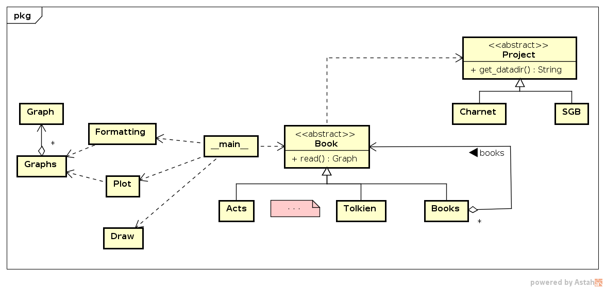

# charnet - character networks

This project performed studies using complex networks in some books. We considered
 characters as nodes and characters encounters as edges. The project
 has a [GitHub page](https://ajholanda.github.io/charnet/) and a
 [manuscript](https://arxiv.org/abs/1704.08197).

## Directories content

* [`_assets`](_assets/) - files used to document or manage the project;
* [`charnet`](charnet/) - Python code for the project;
* [`data`](data/) - data gathered for the project;
* [`sgb-data`](sgb-data/) - some data from [Stanford GraphBase](http://www-cs-faculty.stanford.edu/~uno/sgb.html).

## Prerequisites

* Python and the packages:
  * [matplotlib](https://matplotlib.org/) - used to plot the graphics;
  * [graph-tool](https://graph-tool.skewed.de/) - used to calculate the network measures and draw the graphs;
  * [powerlaw](https://github.com/jeffalstott/powerlaw) - it is a package used to fit data to power law distribution.

## Structure

The structure of the project in [`charnet/`](charnet/) follows,
mainly, the Composite design pattern where `Book` is the `Component`,
`Books` class is the `Composite`, and the books like "acts of the
apostles" (`Acts`) and the biography of J. R. R. Tolkien (`Tolkien`)
are `Leaf`s.
 


- [`Book`](books.py): methods declared here are inherited by `Leaf`
  books, and the main method is `read()` that returns a `Graph`
  containing characters' encounters as edges.

- [`Acts`](books.py): is an example of concrete `Leaf` classes, like
  `Acts` that represents the book "acts of apostles", were coded
  inside inside the file [`books.py`](books.py).

- [`Books`](books.py): is the `Composite` class, `read()` method has a
  different behavior iterating over all `Leaf`s to execute their
  `read()` method.

- [`Formatting`](formatting.py): is responsible to write
  LaTeX-formatted output to append in the paper.

- [`Graphs`](graphs.py): process graphs to obtain measures used in the
  analisys like average degree, betweenness, closeness and lobby.

- `Graph`: is an instance from
  [`Graph`](https://networkx.github.io/documentation/stable/reference/classes/graph.html)
  from NetworkX library.

- [`Plot`](plot.py): plot the curves from data generated from
  graphs.

- [`Draw`](draw.py): draw graphs using graphviz python library.

- [`lobby()`](lobby.py): function to calculate the lobby index.

- [`Charnet`](books.py): helper to handle configuration specific to
  books gathered in this project.

- [`SGB`](books.py): helper to handle configuration specific to books
  gathered in Stanford GraphBase project.

- [`Project`](books.py): template (interface) for project properties.

- [`__main__`](__main__.py): client to execute the operations.

## Running

Install `graph-tool` according to your setup by following the
[installation instructions](https://git.skewed.de/count0/graph-tool/wikis/installation-instructions).


Download the charnet using `git` and enter in the `charnet` directory:

````
$ git clone https://github.com/ajholanda/charnet.git && cd charnet
````

To install the dependencies, the easy way is to run

````
$ python3 setup.py install --user
````

To run all the project tasks:

````
$ python3 charnet -a
````

To print the possible tasks to be performed apart:

````
$ python3 charnet -h
````

To clean the generated files:

````
$ python setup.py clean --all
````

## Feedback

Please, open an [issue](https://github.com/ajholanda/charnet/issues) for any feeback.

